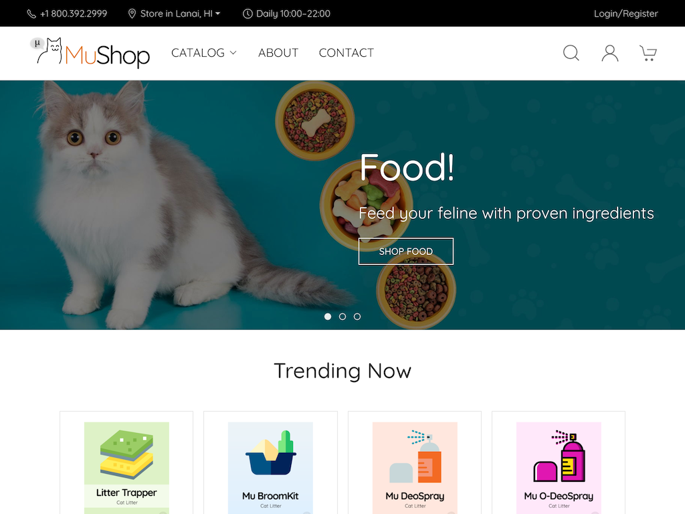
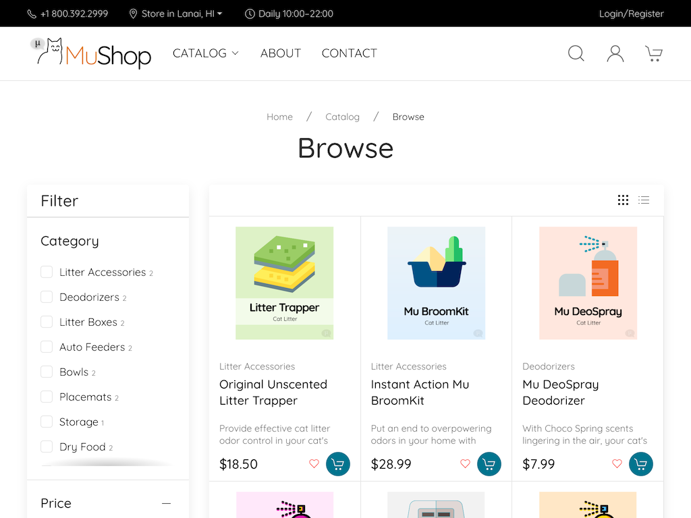
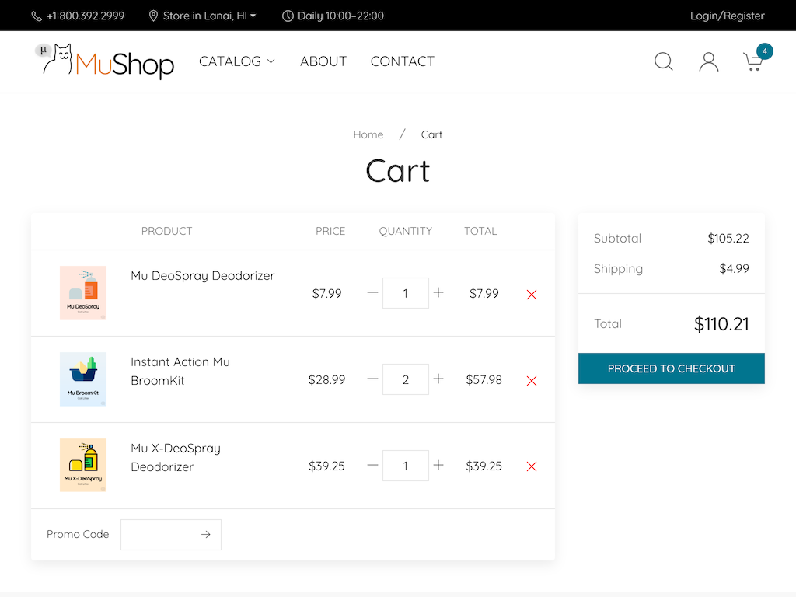
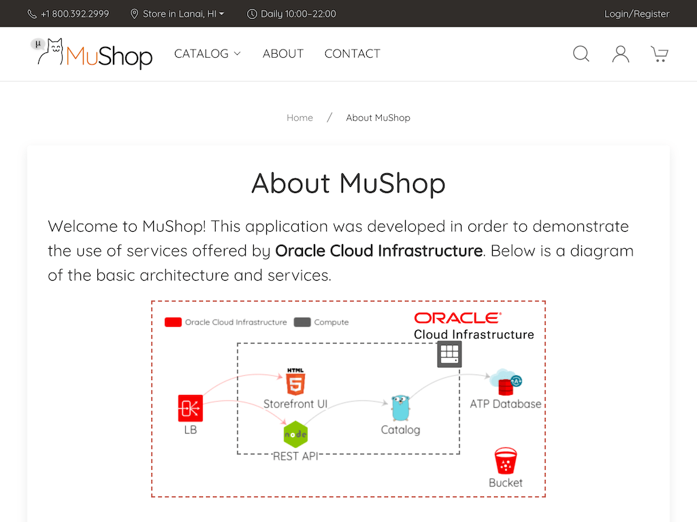
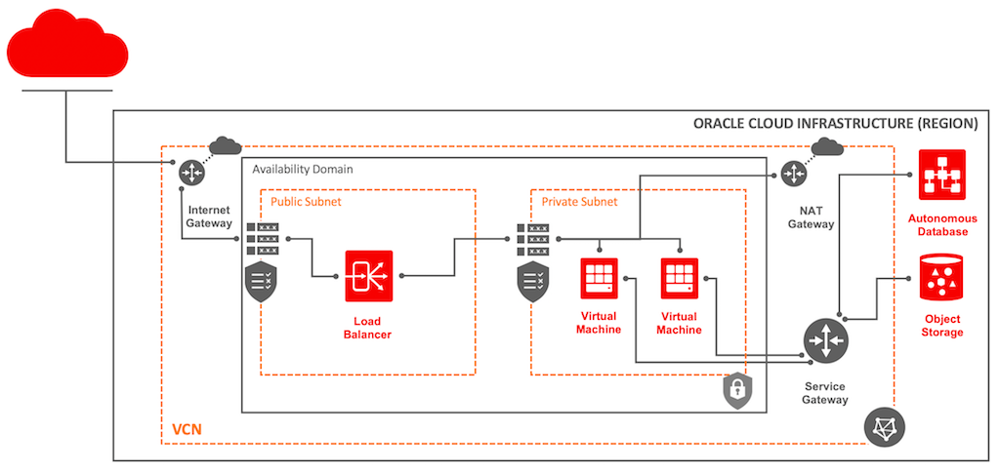

---

This is a Terraform configuration that deploys the MuShop basic sample application on [Oracle Cloud Infrastructure (OCI)][oci]. 

MuShop basic is a 3-tier web application that implements an e-commerce site. It is built to showcase the features of [Oracle Cloud Infrastructure (OCI)][oci]. This application is designed to run using only the Always Free tier resources. 
The repository contains the application code as well as the [Terraform][tf] code to create a [Resource Manager][orm] stack, 
that creates all the required resources and configures the application on the created resources.

|  |  |  |  |
|---|---|---|---|

## Getting Started

The steps below guide you through deploying the application on your tenancy using the OCI Resource Manager.

1. Download the latest [`mushop-basic-stack-v1.0.2.zip`](../../releases/download/v1.0.2/mushop-basic-stack-v1.0.2.zip) file.
2. [Login](https://console.us-ashburn-1.oraclecloud.com/resourcemanager/stacks/create) to Oracle Cloud Infrastructure to import the stack
    > `Home > Solutions & Platform > Resource Manager > Stacks > Create Stack`
3. Upload the `mushop-basic-stack-v1.0.2.zip` file that was downloaded earlier, and provide a name and description for the stack
4. Configure the stack
   1. **Database Name** - You can choose to provide a database name (optional)
   2. **Node Count** - Select if you want to deploy one or two application instances.
   3. **Availability Domain**  - Select any availability domain to create the resources. If you run in to service limits, you could try another availability domain.
5. Review the information and click Create buton. 
   > The upload can take a few seconds, after which you will be taken to the newly created stack
6. On Stack details page, click on `Terraform Actions > Apply`

All the resources will be created, and the URL to the load balancer will be displayed as `lb_public_url` as in the example below.
> The same information is displayed on the Application Information tab

```text
Outputs:

autonomous_database_password = <generated>

comments = The application URL will be unavailable for a few minutes after provisioning, while the application is configured

dev = Made with ❤ by Oracle A-Team

lb_public_url = http://xxx.xxx.xxx.xxx 
```

> The application is being deployed to the compute instances asynchronously, and it may take a couple of minutes for the URL to serve the application.

## Questions

If you have an issue or a question, please take a look at our [FAQs](./deploy/basic/FAQs.md) or [open an issue](https://github.com/oracle/oci-quickstart-cloudnative/issues/new).

## Deployment Topology

The following diagram shows the topology created by this stack.



To learn more about how you can use this application to build your own applications, click [here](./deploy/basic/README.md).

[oci]: https://cloud.oracle.com/en_US/cloud-infrastructure
[orm]: https://docs.cloud.oracle.com/iaas/Content/ResourceManager/Concepts/resourcemanager.htm
[tf]: https://www.terraform.io
