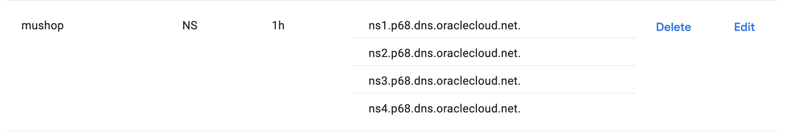

This document shows information on how to use MuShop Basic to deploy on OCI Maximum-Security Zones (MSZ) and use Cloud Guard.

## Topology

This is the topology using MSZ


## Usage

If using the ORM stack, select advanced and the optional options to make things private, including create a secondary vcn.

If using local Terraform or on CloudShell:

- Follow the build instructions from [here (MuShop Basic Build)](https://github.com/oracle-quickstart/oci-cloudnative/blob/master/deploy/basic/README.md#build)
- On the "Rename the file" item, use the `tf_msz.tfvars.example` to rename to `terraform.tfvars`

- Change the credentials variables to your user and any other desirable variables
- Run `terraform init` to init the terraform providers
- Run `terraform apply` to create the resources on OCI

You can also include Web Application Firewall (WAF), DNS or other components as desired.  Note that a public certificate will be required for WAF, and thus requires a DNS zone be created.  See below for more specific instructions.


### Special Note for Enabling DNS and WAF 

In order to enable certificate generation via terraform, you must create a publicly available domain name, and point the (NS) record to OCI DNS.  This can be done prior to running the terraform.  Once complete, allow some time for that to propagate, roughly 30 minutes to be safe.  This can be verified via `dig` or `nslookup`.



Following this, enable the DNS and certificate parameters within the `terraform.tfvars` file that you have prepared.  The DNS zone and WAF policy will be created within the LB compartment.  The DNS zone you configure for terraform can be a subdomain to the owned domain name, such as `mushop.example.com`. When WAF is enabled, 2 records will be added, one for the internal load balancer, and one for WAF, which users will hit.  The certificate that is generated by Lets Encrypt will use the WAF name as its Common Name and will also add the LB as a Subject Alternative name.

Regarding certificate generation, Lets Encrypt encourages the use of the staging URL by default, and only to use the production URL when ready, as there are limits to daily usage.  The default parameter in the configuration uses the staging URL, so it is recommended to switch it once you are sure everything is working. It is possible to use terraform targeting to test this, but you must be careful to create the DNS zone and certificate together.  If you do not need to do this, simply run through the entire process and switch the URL afterwards and re-run.

Another notable change that will occur when using WAF is that a new Network Security Group will be configured and applied directly to the Load Balancer.  This NSG allows access to the LB only from the list of IP addresses associated with Oracle WAF.  Consequently, the Security List for the LB Subnet will not provide access on ports 80 or 443, as the NSG will open 443 from WAF IP addresses to the Load Balancer.

Lastly when enabling WAF, you will experience a longer terraform run time than before - it takes roughly 25 minutes to create a WAF Policy, and only after that will you see the WAF DNS record in the created zone.  In order to allow terraform to run and complete without risking a timeout, you should run it as follows:
```bash
prompt> nohup terraform apply -auto-approve >> apply.txt 2>&1 &
prompt> tail -f apply.txt
```

Once the terraform completes, the WAF Policy and DNS Zone should reflect correctly, and you can hit the external URL, such as `store.mushop.example.com`.  The browser should indicate a clean certificate, and the information dialog for it should show what is configured.  Finally, if the CAPTCHA challenge for WAF is enabled, test that by navigating the store to any product page, and it will challenge you before displaying content.

[oci]: https://cloud.oracle.com/en_US/cloud-infrastructure
[orm]: https://docs.cloud.oracle.com/iaas/Content/ResourceManager/Concepts/resourcemanager.htm
[tf]: https://www.terraform.io
[net]: https://docs.cloud.oracle.com/iaas/Content/Network/Concepts/overview.htm
[vcn]: https://docs.cloud.oracle.com/iaas/Content/Network/Tasks/managingVCNs.htm
[lb]: https://docs.cloud.oracle.com/iaas/Content/Balance/Concepts/balanceoverview.htm
[igw]: https://docs.cloud.oracle.com/iaas/Content/Network/Tasks/managingIGs.htm
[natgw]: https://docs.cloud.oracle.com/iaas/Content/Network/Tasks/NATgateway.htm
[svcgw]: https://docs.cloud.oracle.com/iaas/Content/Network/Tasks/servicegateway.htm
[rt]: https://docs.cloud.oracle.com/iaas/Content/Network/Tasks/managingroutetables.htm
[seclist]: https://docs.cloud.oracle.com/iaas/Content/Network/Concepts/securitylists.htm
[adb]: https://docs.cloud.oracle.com/iaas/Content/Database/Concepts/adboverview.htm
[inst]: https://docs.cloud.oracle.com/iaas/Content/Compute/Concepts/computeoverview.htm
[kms]: https://docs.cloud.oracle.com/en-us/iaas/Content/KeyManagement/Concepts/keyoverview.htm
