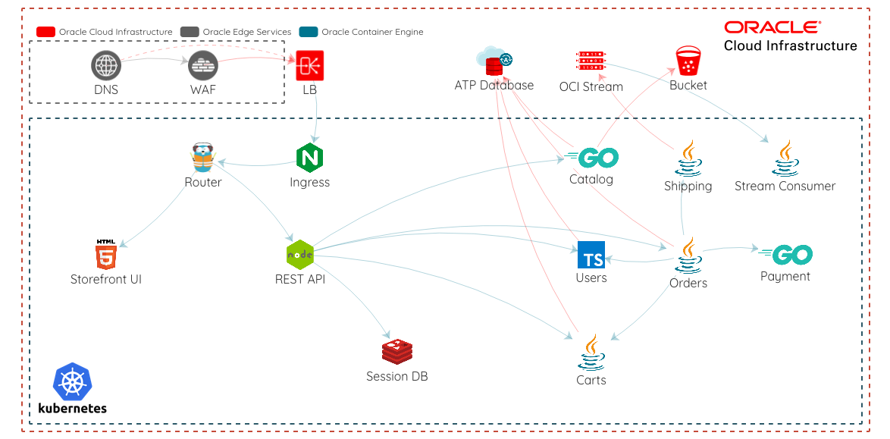

#         [![Deploy to Oracle Cloud][magic_button]][magic_mushop_stack]

MuShop Complete is a polyglot micro-services application built to showcase a cloud native approach to application development on [Oracle Cloud Infrastructure][oci] using Oracle's [cloud native](https://www.oracle.com/cloud/cloud-native/) services. MuShop Complete uses a Kubernetes cluster, and can be deployed using the provided `helm` charts (preferred), or Kubernetes manifests. It is recommended to use an Oracle Container Engine for Kubernetes cluster, however other Kubernetes distributions will also work.

The [helm chart documentation][chartdocs] walks through the deployment process and various options for customizing the deployment.

## Topology

The following diagram shows the topology created by this stack.

## Questions

If you have an issue or a question, please take a look at our [FAQs](./deploy/basic/FAQs.md) or [open an issue](https://github.com/oracle-quickstart/oci-cloudnative/issues/new).

[oci]: https://cloud.oracle.com/en_US/cloud-infrastructure
[orm]: https://docs.cloud.oracle.com/iaas/Content/ResourceManager/Concepts/resourcemanager.htm
[tf]: https://www.terraform.io
[chartdocs]: https://github.com/oracle-quickstart/oci-cloudnative/tree/master/deploy/complete/helm-chart#setup
[magic_button]: https://oci-resourcemanager-plugin.plugins.oci.oraclecloud.com/latest/deploy-to-oracle-cloud.svg
[magic_mushop_stack]: https://cloud.oracle.com/resourcemanager/stacks/create?zipUrl=https://github.com/oracle-quickstart/oci-cloudnative/releases/latest/download/mushop-stack-latest.zip
