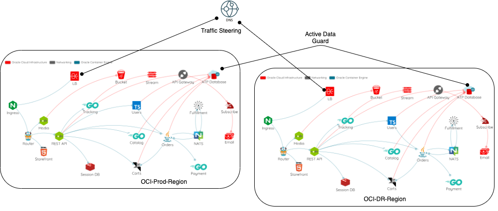

## Introduction

In this section let us discuss and implement the disaster recovery solution for
MuShop deployed on OCI (Oracle Cloud Infrastructure) using the recently announced
[Cross-Region Autonomous Data Guard for Autonomous databases](https://blogs.oracle.com/datawarehousing/cross-region-autonomous-data-guard-your-complete-autonomous-database-disaster-recovery-solution)
feature to demonstrate the DR (Disaster Recovery) solution.

## Scenario Details
The above picture shows MuShop (polyglot microservices demo application) deployed
on OKE (Oracle Cloud Infrastructure Container Engine for Kubernetes) clusters on 
`us-phoenix-1` (Primary) and `us-ashburn-1` (DR) regions (These regions are used here as an example). 
The Autonomous data guard is enabled between the two Autonomous databases across these two regions. 
If you need to refresh some concepts on Autonomous Data Guard, suggest you refer to [this](https://blogs.oracle.com/datawarehousing/cross-region-autonomous-data-guard-your-complete-autonomous-database-disaster-recovery-solution) blog. 
Finally, we will use the OCI DNS traffic steering to DNS failover to DR in case of disaster at the Primary site.
 

## Procedure 
Induce the Primary site failure by doing a manual failover of 
Autonomous database at source and the MuShop application at the DR would 
then take over and serve the users by connecting to the DR ADB (Autonomous Database).

## Steps

For this example we shall consider `us-phoenix-1` as the source and `us-ashburn-1` as the destination.
The detailed steps are covered [here](). Below are the steps at a high level:

- Create the Source and DR ATP (Autonomous transaction processing) databases.

- Create OKE clusters on both primary (`us-phoenix-1`) and DR (`us-ashburn-1`) sites.

- Deploy MuShop on both Primary Site (`us-phoenix-1`).

- Verify the application working at the source (`us-phoenix-1`). Access `https://<primary-site-ingress-ip-address>/api/catalogue` and ensure that you would see the all the MuShop catalogue products listed without errors.

- Perform ADB failover from ``us-phoenix-1`` to `us-ashburn-1`. We need to do this because the ADB needs to be available at the DR site for the MuShop pods to perform the initialization when we setup MuShop at the DR site. Else the pods would be stuck in the initialization state.

- Setup MuShop on DR site (`us-ashburn-1`). When we setup the MuShop at DR it would not re-initialize the DB schemas or tables. This intelligence has to be built in the application.

- Verify the application working at the DR region (`us-ashburn-1`). Access `https://<dr-site-ingress-ip-address>/api/catalogue` and ensure that you would see the all the MuShop catalogue products listed without errors.

At this point the setup is ready to perform DR testing.

## DR Testing

Notice that the source site has lost access to all the products within 
MuShop and the DR site has access to all the products as the ADB was switched over.

You can then switch back to the primary site (`us-phoenix-1`) in this case and 
observe the opposite behavior.

## WAF and DNS traffic steering

Further, we add WAF and DNS traffic steering policy to automatically switch 
the DNS from Source site to Destination site. For this we make use of creating
a http healthcheck monitor on `https://<primary-site-ingress-ip-address>/api/catalogue`. 
When we failover the ATP (Autonomous Database) manually or when there is a 
disaster at Primary site, this check would then fail and automatically change 
the DNS to point to DR Ingress IP. 

## Next